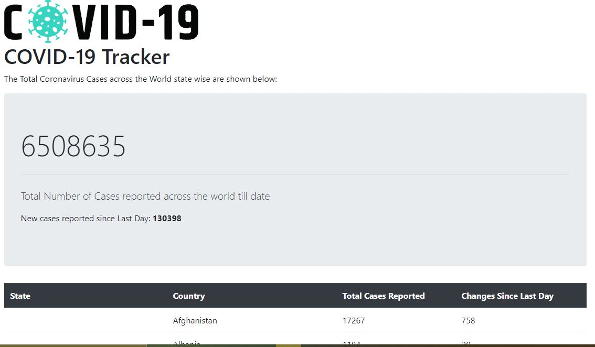
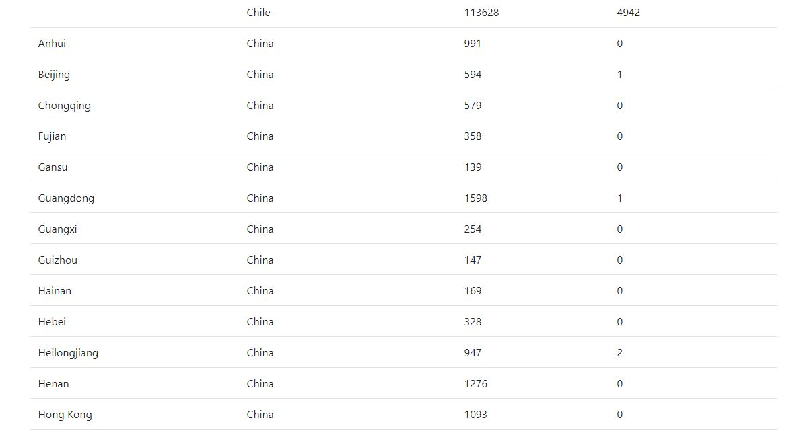

# Coronavirus-global-tracker

A Global Coronavirus Tracking Application built on Spring Boot and Thymeleaf.

## Data Source:

COVID-19 Data Repository by the Center for Systems Science and Engineering (CSSE) at Johns Hopkins University
https://github.com/CSSEGISandData/COVID-19

## URL

localhost:8080

## IMAGES

  

